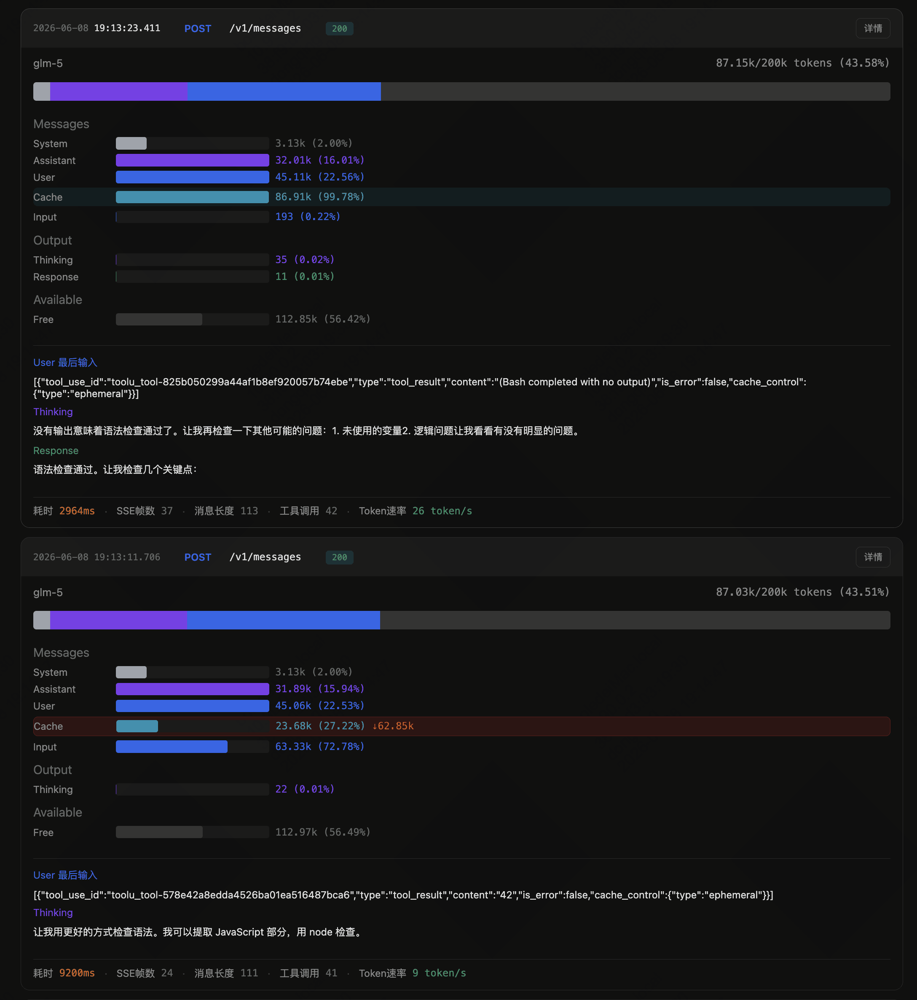
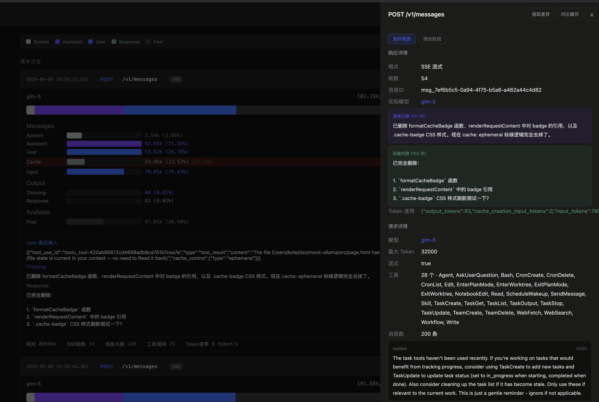
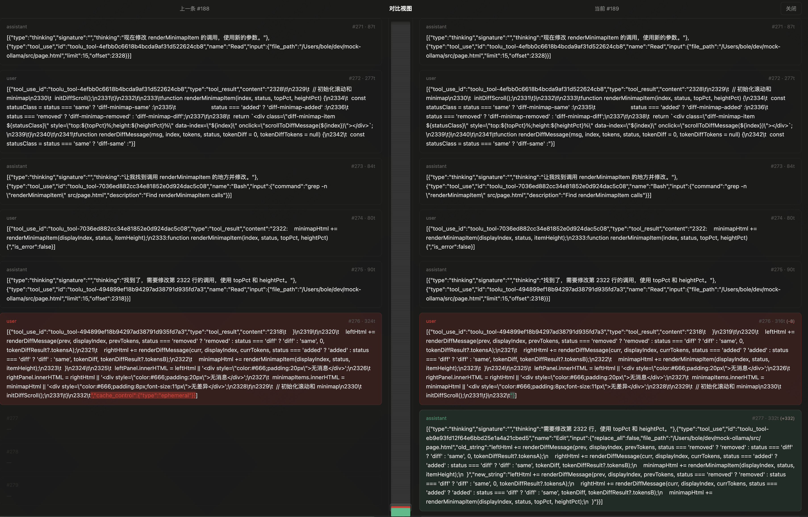

# mock-ollama

把第三方大模型接口伪装成 `Ollama` 服务，方便本地插件或脚本继续按 `http://localhost:11434` 这一套接入。

当前主要用途：

- 代理 OpenAI Chat Completions、Anthropic Messages 和 OpenAI Responses 接口
- 暴露 Ollama 风格的 discovery/metadata 接口：`/api/version`、`/api/tags`、`/api/show`
- Web UI 实时监控请求日志、Token 分布、Cache 命中

Ollama 兼容范围仅限上述 discovery/metadata 接口；不支持 Ollama 的 `/api/chat` 和 `/api/generate`。聊天请求请使用下文列出的 Chat Completions、Messages 或 Responses 路由。

## 安装

### 全局安装

```bash
npm install -g mock-ollama
mock-ollama -h
```

## 快速开始

最常见的是把它指到一个 OpenAI 兼容上游，比如 GLM：

```bash
export MOCK_OLLAMA_BASE_URL="https://open.bigmodel.cn/api/paas/v4"
export MOCK_OLLAMA_API_KEY="your-api-key"
mock-ollama
```

启动后默认监听：

```bash
http://localhost:11434
```

可以先测2个接口：

```bash
curl http://localhost:11434/api/version
curl http://localhost:11434/api/tags
```

聊天请求示例：

```bash
curl -X POST http://localhost:11434/chat/completions \
  -H "Content-Type: application/json" \
  -d '{
    "model": "glm-5",
    "messages": [
      { "role": "user", "content": "你好" }
    ]
  }'
```

## 参数

```bash
mock-ollama --url <上游地址> --apikey <上游密钥>
```

常用参数：

- `--host`：监听地址，默认 `localhost`
- `--port`：监听端口，默认 `11434`
- `--url`：上游服务地址
- `--apikey`：上游服务密钥
- `--api-style`：上游 API 格式，支持 `auto`、`anthropic`、`responses`、`chat`，默认 `auto` 自动探测
- `--bridge`：启用 Anthropic/Responses/Chat 三格式矩阵互转，默认关闭
- `--quiet`：安静模式，关闭详细日志
- `--open`：启动后自动打开浏览器
- `--max_context`：网页上下文上限（token），默认 `200000`

## 环境变量

- `MOCK_OLLAMA_BASE_URL`：上游服务地址
- `MOCK_OLLAMA_API_KEY`：上游服务密钥

示例：

```bash
export MOCK_OLLAMA_BASE_URL="https://open.bigmodel.cn/api/paas/v4"
export MOCK_OLLAMA_API_KEY="your-api-key"
mock-ollama
```

强制使用 Anthropic 兼容接口：

```bash
mock-ollama --url "https://api.example.com" --apikey "your-key" --api-style anthropic
```

## bridge 矩阵互转模式

`--bridge` 开启后，入站协议与上游协议不同时自动互转，覆盖 Anthropic Messages / OpenAI Responses / Chat Completions 三格式的 3×3 矩阵（同格式则透传）。支持文本、SSE 流、工具调用、system 消息、reasoning。

```bash
mock-ollama --api-style responses --bridge --url "https://api.example.com/v1" --apikey "your-key"
```

### Cursor 公网代理

主服务 `11434` 含 Web UI 和管理接口，不要直接暴露。另起一个仅含 BYOK 路由的公网入口：

```bash
# 1. 主服务，只在本机监听
mock-ollama --url "https://api.example.com/v1" --apikey "your-key" --api-style responses --bridge

# 2. Cursor 入口，自动启动临时 Cloudflare Tunnel
mock-ollama --cursor
```

代理启动时从主服务拉取真实模型列表，打印 Cursor Settings 所需的 Base URL、API Key 和模型名。Cursor 端启用 `Override OpenAI Base URL`，填入打印的地址、Key 和任一模型名，可填多个自由切换。

可选参数：

| 参数 | 默认值 | 功能 |
|---|---|---|
| `--cursor-port` | `11435` | Cursor 专用本机回环端口 |
| `--cursor-api-key` | 随机生成 | 固定 Bearer key，不指定则每次启动生成 |
| `--cursor-tunnel` | `quick` | `off` 则仅启动本地入口，不套 Cloudflare 隧道 |
| `--cursor-upstream` | `http://localhost:11434` | 已启动的主服务地址 |

公网入口仅暴露 `/healthz`、`/v1/models`、`/v1/chat/completions`，除健康检查外均需 Bearer 认证。临时 `trycloudflare.com` 地址重启会变，长期使用请配置受控域名和 Cloudflare Access。

在兼容 Anthropic 协议的客户端配置文件中，可设置：

```json
{
  "env": {
    "ANTHROPIC_BASE_URL": "http://localhost:11434",
    "ANTHROPIC_AUTH_TOKEN": "ollama",
    "CLAUDE_CODE_DISABLE_NONESSENTIAL_TRAFFIC": "1"
  }
}
```

## 路由接口

- `GET /`：Web UI
- `GET /api/version`：Ollama discovery/metadata
- `GET /api/info`：当前服务配置（密钥脱敏）
- `GET /api/logs`：请求日志
- `DELETE /api/logs`：清空请求日志
- `GET /api/logs/stream`：日志 SSE 推送
- `POST /api/show`：Ollama discovery/metadata
- `GET /api/tags`：Ollama discovery/metadata
- `POST /chat/completions`：Chat Completions
- `POST /v1/chat/completions`：Chat Completions
- `POST /v1/messages`：Anthropic Messages
- `POST /v1/responses`：OpenAI Responses
- 其余路径：返回 `404`

## Web UI

启动后访问 `http://localhost:11434` 即可打开 Web 监控界面。

功能：

- **实时推送**：SSE 实时接收新请求，自动刷新列表
- **会话标识**：日志卡片标题显示完整会话 ID；未提供时显示“无会话标识”
- **Token 分布条**：可视化展示 System/User/Assistant/Thinking/Response 等各部分占比
- **Cache 监控**：显示缓存命中情况，仅与同一会话的上一条 POST 请求比较；缓存下降时红色警告
- **友好视图**：解析请求/响应，展示关键信息
- **原始数据**：一键复制完整 JSON 数据
- **对比视图**：仅与同一会话的上一条 POST 请求对比，Token 级别 LCS diff 高亮差异
- **提取差异**：仅提取与同一会话的上一条 POST 请求相比发生变化的消息内容，复制到剪贴板

界面截图：

### 主界面



### 详情面板



### 对比视图



## 许可证

`ISC`
